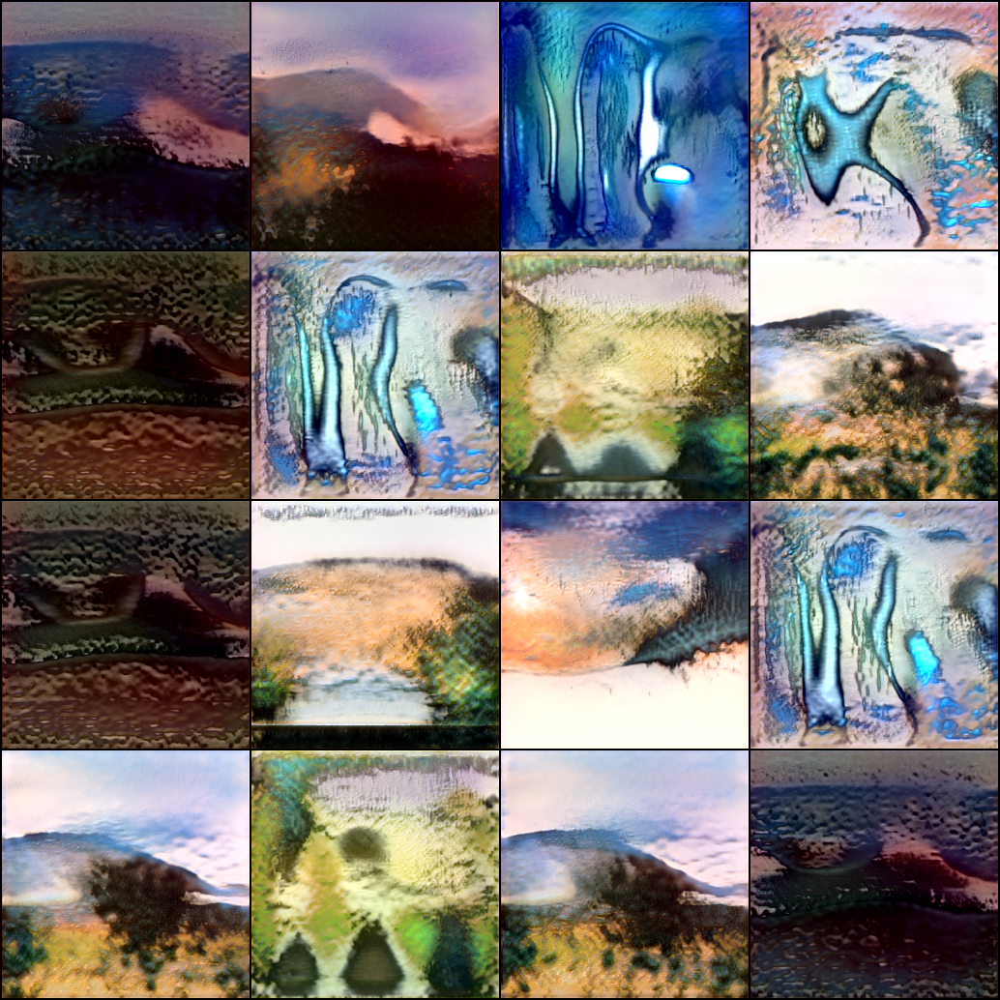
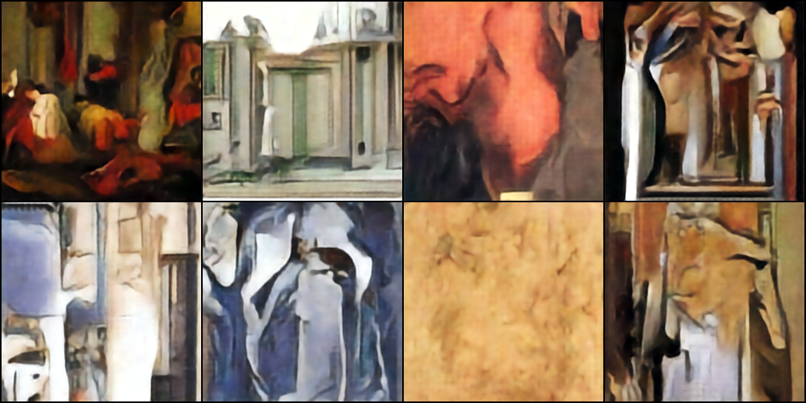
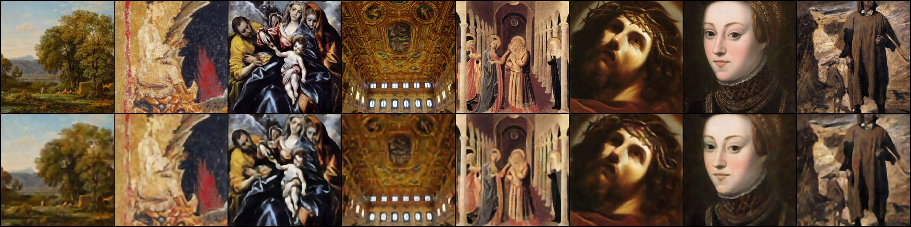

# StyleGAN & Cheap DiT

[](https://github.com/Westerbay/StyleGan-and-Cheap-DiT/actions/workflows/ci.yml)
[](https://github.com/Westerbay/StyleGan-and-Cheap-DiT/actions/workflows/container.yml)
[](LICENSE)

Compact PyTorch implementations of a StyleGAN-inspired generator and a latent diffusion transformer for **256 × 256 image generation**. This academic project explores model architecture, training stability, and the trade-off between image quality and computational cost.

The repository includes training and inference scripts, pretrained checkpoints, sample outputs, and a step-by-step diffusion demo. The implementations are intentionally small and experimental; they are not reproductions of the full StyleGAN or DiT training pipelines.

## Models at a glance

| | StyleGAN-inspired GAN | Cheap DiT |
| --- | --- | --- |
| Approach | Adversarial training | Diffusion in VAE latent space |
| Core architecture | Mapping network, style modulation with AdaIN, synthesis network | Convolutional VAE and transformer denoiser |
| Representation | RGB images at 256 × 256 | 4-channel latents at 32 × 32 |
| Included examples | Landscapes | Paintings |
| Main limitations | Training instability and mode collapse | Imperfect VAE reconstructions and slow iterative sampling |

The diffusion experiments began in pixel space, then moved to latent space to reduce the transformer sequence length. The default latent model uses 1,000 diffusion steps, eight transformer layers, eight attention heads, and an embedding dimension of 512. “Cheap” describes this reduction in computational cost; training and inference can still be demanding.

## Sample outputs

### StyleGAN — landscapes



### Latent diffusion — paintings



### VAE reconstructions



These grids illustrate the experiments; no quantitative quality benchmark is provided.

## Try the Docker demo

The container bundles the diffusion API, pretrained weights, and the separate [React interface](https://github.com/Westerbay/ui-for-generative-models).

```bash
docker pull ghcr.io/westerbay/stylegan-and-cheap-dit:latest

# CPU
docker run --rm -p 127.0.0.1:5173:5173 ghcr.io/westerbay/stylegan-and-cheap-dit:latest

# NVIDIA GPU (requires a compatible driver and NVIDIA Container Toolkit)
docker run --rm --gpus all -p 127.0.0.1:5173:5173 ghcr.io/westerbay/stylegan-and-cheap-dit:latest
```

Open **http://localhost:5173**. The frontend proxies `/api` requests to the API inside the container, so publishing port 7050 is unnecessary for the demo. CPU sampling is supported but can be slow.

The demo uses the Vite development server and a shared in-memory generation session. It is intended for local, single-user experimentation; it has no authentication or per-user isolation.

Historical image tags `v0.1` and `v0.3` retain the original GitLab images. `latest` tracks successful builds of `main`; use a release tag or image digest when you need a fixed version.

## Local installation

Use Python 3.11 (the CI version), Git, and Git LFS. Run commands from the repository root.

```bash
git lfs install
git clone git@github.com:Westerbay/StyleGan-and-Cheap-DiT.git
cd StyleGan-and-Cheap-DiT
git lfs pull
git lfs fsck

python -m venv .venv
source .venv/bin/activate  # PowerShell: .venv\Scripts\Activate.ps1
python -m pip install -r requirements.txt
python scripts/check_models.py
```

For a GPU environment, install the appropriate PyTorch and torchvision builds for your CUDA setup. The scripts automatically select CUDA when available.

The three pretrained files in `models/` use Git LFS and total approximately **266 MB**. If a checkpoint is only about 130 bytes, it is an LFS pointer: run `git lfs pull` before inference or a Docker build. GitHub's source ZIP is not the recommended installation path.

## Generate images

```bash
python generate_gan.py
python generate_ldm.py
```

| Script | Checkpoint | Output |
| --- | --- | --- |
| `generate_gan.py` | `models/generator.pth` | `generated/gan_output.png` (16-image grid) |
| `generate_ldm.py` | `models/ldm.pth` | `generated/output_ldm.png` (one image) |

Generation settings are constants in the scripts rather than command-line arguments. Keep architecture settings consistent with the checkpoint you load.

### Run the API and frontend separately

Start the backend with `python api_ldm.py`; its interactive API documentation is available at **http://localhost:7050/docs**.

In another terminal:

```bash
git clone git@github.com:Westerbay/ui-for-generative-models.git
cd ui-for-generative-models/application
npm ci
npm run start
```

Use Node.js 22. Open **http://localhost:5173**. The Vite proxy forwards `/api` to `http://localhost:7050`.

| Endpoint | Behavior |
| --- | --- |
| `GET /start?batch_size=1` | Start or replace the shared generation session |
| `GET /step` | Run one denoising step and return base64-encoded PNG previews |

## Train on your own data

Datasets are not included. The dataset loader recursively reads JPEG, PNG, and WebP files, converts them to RGB, resizes and center-crops to 256 × 256, and normalizes to `[-1, 1]`.

1. Set the dataset path in `train_gan.py` (default: `landscapes/`) or `DATA_ROOT` in `train_latentdiff.py` (default: `artwork/`).
2. Adjust batch size, epochs, and learning rates in the selected script to match your hardware.
3. Run the training script:

   ```bash
   python train_gan.py
   # Or: train the VAE first, then the latent denoiser
   python train_latentdiff.py
   ```

| Training script | Checkpoints written to the repository root | Sample directory |
| --- | --- | --- |
| `train_gan.py` | `generator.pth`, `discriminator.pth` | `samples_gan/` |
| `train_latentdiff.py` | `ldm.pth` | `samples_ldm/vae/`, `samples_ldm/diffusion/` |

Inference reads from `models/`. To use newly trained weights, back up the pretrained files and copy your selected checkpoints into that directory. Training does not automatically replace the included models.

Optional augmentation is available through `preprocess.py`. Edit its source and destination directories first (defaults: `pokemon/` and `pokemon_preprocessed/`); it applies resizing, flips, rotations, crops, and color jitter. Point the training script at the resulting directory.

## Repository layout

```text
api/                   Stateful diffusion service and generation session
data/                  Image dataset and augmentation utilities
deep/                  GAN, VAE, diffusion, and transformer implementations
models/                Pretrained checkpoints tracked with Git LFS
resources/             Reference papers and teaching material
samples_gan/           GAN training samples
samples_ldm/           Diffusion samples and VAE reconstructions
scripts/               Checkpoint validation and inference smoke test
docker/                Container startup script
.github/workflows/     CI, container publishing, and historical image migration
```

## Development and releases

```bash
python scripts/check_models.py
python scripts/smoke_models.py
docker build -t stylegan-and-cheap-dit:local .
docker run --rm -p 127.0.0.1:5173:5173 stylegan-and-cheap-dit:local
```

The Docker build uses the current checkout and a pinned commit from the frontend repository (`UI_REF` in `Dockerfile`). Use `--build-arg UI_REF=<commit>` to select another frontend revision.

- **CI:** validates LFS files, checks Python syntax, loads all three checkpoints, and exercises GAN inference and one diffusion step on CPU.
- **Pull requests:** build and smoke-test the container without publishing images.
- **Pushes to `main`:** smoke-test and publish `latest` and `sha-<full-commit>` tags to GHCR.
- **New `v*` tags:** publish the matching container tag and create a GitHub release after the container checks pass.

Publication uses the repository's `GITHUB_TOKEN`; no GitLab credentials are required. Package visibility must be public to allow anonymous image pulls. See [migration notes](docs/migration.md) for historical tags and the registry-copy workflow.

## References

- Karras et al., *A Style-Based Generator Architecture for Generative Adversarial Networks* (CVPR 2019).
- Ho et al., *Denoising Diffusion Probabilistic Models* (NeurIPS 2020).
- Reference PDFs and teaching materials are available in [`resources/`](resources/).

## License

The project is licensed under the [MIT License](LICENSE). Reference papers and other third-party materials remain subject to their respective terms.
